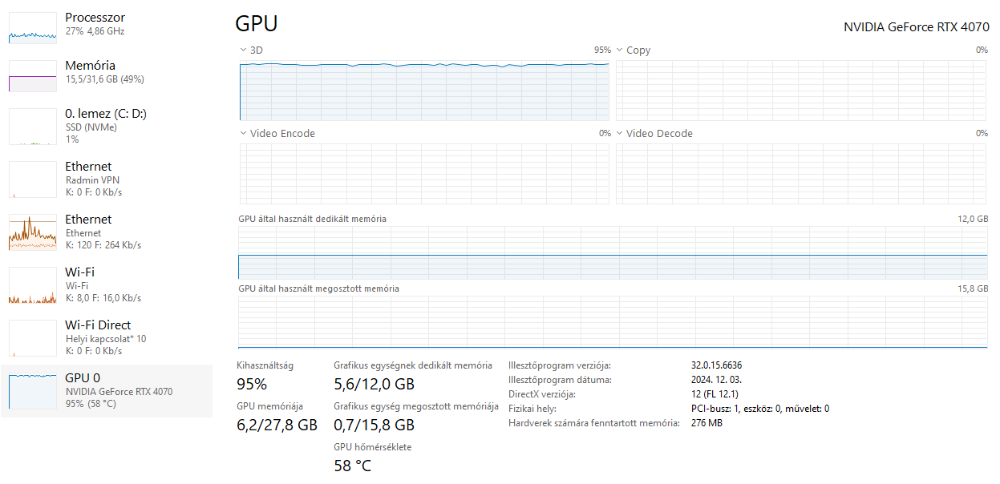
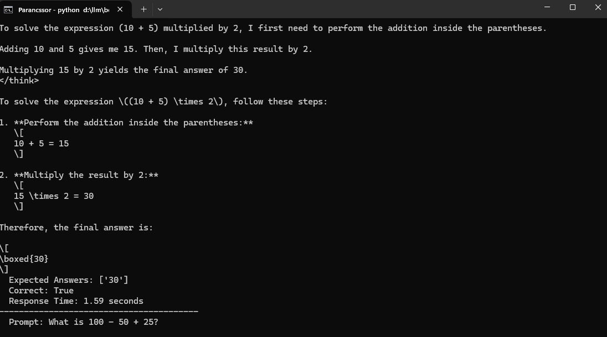
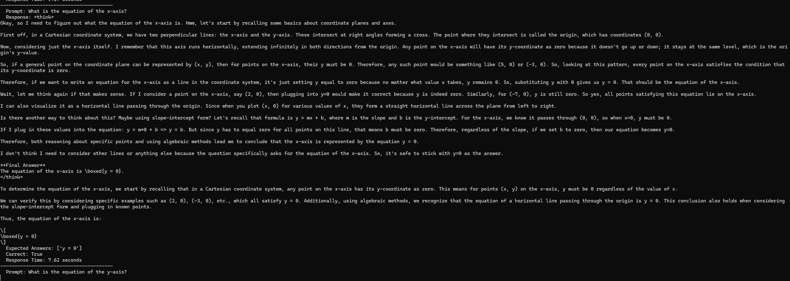
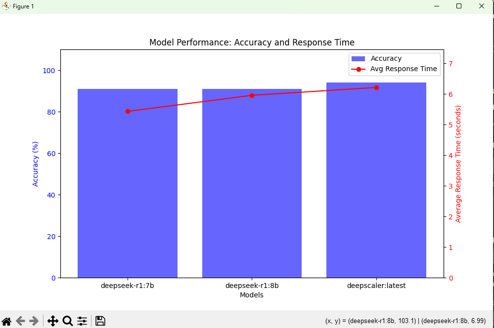

# Ollama Model Benchmarking Script

This repository contains a Python script to benchmark and compare the performance of different Ollama AI models (e.g., `deepseek-r1:7b`, `deepseek-r1:8b`, `deepscaler:latest`) using a set of 100 test questions. The script evaluates the models based on **accuracy** and **response time** and generates a visual report using `matplotlib`.

---

## Features

- **100 Test Questions**: Includes a mix of mathematical, coordinate geometry, and equation-solving questions.
- **Multiple Correct Answers**: Supports multiple valid answers for each question (e.g., `x = 2` or `x = -2` for `x² - 4 = 0`).
- **Accuracy and Response Time**: Calculates the accuracy and average response time for each model.
- **Visualization**: Generates a bar chart for accuracy and a line plot for response time using `matplotlib`.

---

## Prerequisites

Before running the script, ensure you have the following installed:

1. **Python 3.8+**: Download and install Python from [python.org](https://www.python.org/).
2. **Ollama Python Package**: Install the `ollama` package to interact with Ollama models.
3. **Matplotlib**: Install `matplotlib` for generating visualizations.

You can install the required packages using the following command:

```bash
pip install ollama matplotlib
```

My config and how much resources used while i ran the test:

Ryzen 7700X, Nvidia 4070 12GB, RAM 32GB 5600MHz cl36


---

## Usage

1. **Clone the Repository**:
   ```bash
   git clone https://github.com/your-username/ollama-benchmark.git
   cd ollama-benchmark
   ```

2. **Run the Script**:
   ```bash
   python benchmark_ollama.py
   ```

3. **View Results**:
   - The script will print the accuracy and average response time for each model in the console.
   - A graph will pop up showing the accuracy (blue bars) and response time (red line) for each model.

---

## Customization

### Modify Models to Test
You can change the models being benchmarked by editing the `MODELS_TO_TEST` list in the script:

```python
MODELS_TO_TEST = ["deepseek-r1:7b", "deepseek-r1:8b", "deepscaler:latest"]
```

### Add or Modify Questions
You can add or modify questions in the `PROMPTS_WITH_ANSWERS` list. Each question is a dictionary with the following structure:

```python
{
    "prompt": "What is 2 + 2?",
    "expected_answers": ["4"]
}
```

For questions with multiple valid answers, provide a list of expected answers:

```python
{
    "prompt": "What is the square root of 64?",
    "expected_answers": ["8", "-8"]
}
```

---

## Example Output

### Console Output
```
Testing model: deepseek-r1:7b
  Prompt: What is 2 + 2?
  Response: 4
  Expected Answers: ['4']
  Correct: True
  Response Time: 1.23 seconds
----------------------------------------
  Prompt: What is the square root of 64?
  Response: 8
  Expected Answers: ['8', '-8']
  Correct: True
  Response Time: 1.45 seconds
----------------------------------------

Model Metrics:
deepseek-r1:7b:
  Accuracy: 91.00%
  Average Response Time: 5.43 seconds
deepseek-r1:8b:
  Accuracy: 91.00%
  Average Response Time: 5.96 seconds
deepscaler:latest:
  Accuracy: 94.00%
  Average Response Time: 6.22 seconds
```




### Graph Output
- A graph will pop up showing:
  - **Blue bars**: Accuracy of each model.
  - **Red line**: Average response time of each model.


---

## License

This project is licensed under the MIT License. See the [LICENSE](LICENSE) file for details.

---

## Contributing

Contributions are welcome! If you have suggestions for improving the script or adding more test questions, feel free to open an issue or submit a pull request.

---

## Acknowledgments

- [Ollama](https://ollama.ai/) for providing the AI models.
- [Matplotlib](https://matplotlib.org/) for visualization.

---

Let me know if you need further assistance!